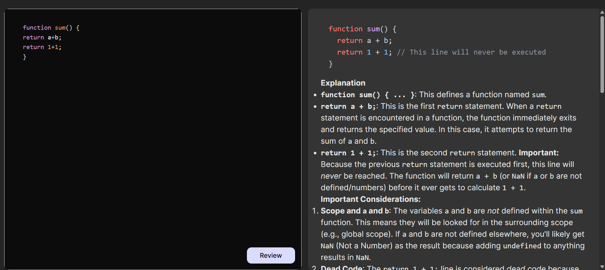

# Code Reviewer

## 😎 Overview
This is **Code Reviewer AI** built with **React.js** and **Node.js**. It reviews the code snipets and gives the  improvemets of the code or errors if there any in the code. It also gives the suggestion for the code improvements and optimization.

## Features

- **Code Sharing**: Upload and share code snippets for review.
- **Review System**: Add comments and feedback on shared code.
- **Code improvements**:Improve the current code.
- **Error identification**:Identifies the errors.
- **Good Explination**:Good explination and suggestions.


## Tech Stack

- **Frontend**: React.js
- **Backend**: Node.js, Express.js

## 📂 Project Structure
           # Project documentation

        ```
        code-reviewer/
        ├── frontend/               # Frontend React application
        │   ├── public/           # Static files
        │   ├── src/              # React source code
        │   │   ├── components/   # Reusable components
        │   │   ├── pages/        # Application pages
        |   |   ├──assets/
        │   │   ├── utils/        # Utility functions
        │   │   ├── App.js        # Main app component
        │   │   ├── index.js      # Entry point
        │   └── package.json      # Frontend dependencies
        ├── backend/               # Backend Node.js application
        │   ├── config/           # Configuration files
        │   ├── controllers/      # Route controllers
        │   ├── models/           # Database models
        │   ├── routes/           # API routes
        │   ├── services/         # AI services
        │   ├── server.js         # Entry point
        │   └── package.json      # Backend dependencies
        ├── .gitignore            # Git ignore file
        ├── README.md             # Project documentation
        └── LICENSE               # License file
        ```

## Installation

1. Clone the repository:
    ```bash
    git clone https://github.com/your-username/code-reviewer.git
    ```
2. Navigate to the project directory:
    ```bash
    cd code-reviewer
    ```
3. Install dependencies for both client and server:
    ```bash
    cd frontend
    npm install
    cd  backend
    npm install
    ```
4. Set up environment variables:
    - Create a `.env` file in the `server` directory.
    - Add the following:
      ```
     GEMINI_API_KEY="your-api-key-here"
      
      ```

5. Start the development servers:
    ```bash
    # In one terminal
    cd frontend
    npm run dev

    # In another terminal
    cd backend
    node server.js
    ```

## 🖼️ Screenshots
![code reviewer Screenshot]



## 🤝 Contributing
1. Fork the project
2. Create your feature branch: `git checkout -b feature-name`
3. Commit your changes: `git commit -m 'Add some feature'`
4. Push to the branch: `git push origin feature-name`
5. Open a pull request

## License

This project is licensed under the [MIT License](LICENSE).

## Contact

For questions or feedback, please contact (https://maheshbadampudi.netlify.app/).

---
Made with ❤️ by [Mahesh](https://github.com/badampudimahesh2005)